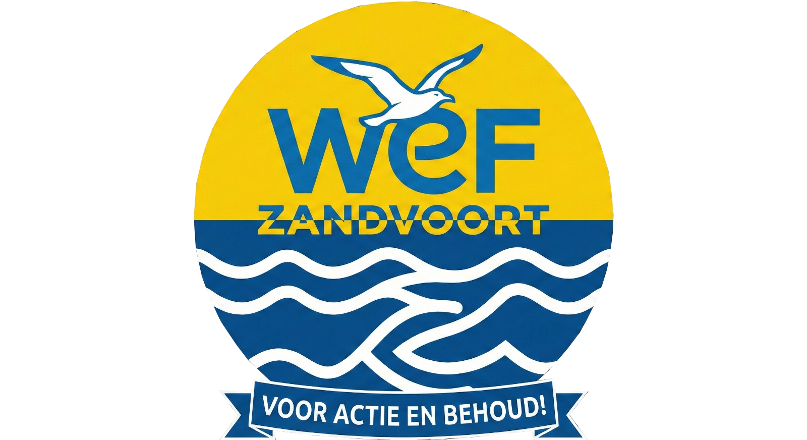

# 🦬 DOCUMENT: GEHEIM - OPERATIE BUFFALO-BANK
Aan alle leden van Scoutinggroep De Buffalo's,

De voorbereidingen voor de overname zijn in volle gang. 
Om dit te betalen hebben wij een bankrekening geopend bij de geheime Buffalo-Bank.

LET OP: Omdat we nogal eens een wachtwoord vergeten, staat onze centrale "loper" (de wordlist) hier in deze map. Mocht je niet meer kunnen inloggen op de bank, gebruik dan onze eigen kraak-tool.

## 📋 Instructies voor de Buffalo's:
1. De Sleutels Ophalen:

* Open het bestand wordlist.txt in deze map.
* Klik op de knop "Raw" om de pure tekstlijst te openen.
* Kopieer de volledige link uit de adresbalk.

2. De Kraak-Tool Starten:

* Start het programma kraak.ps1 op de laptop.
* of kraak.sh op een Linux-machine met een `chmod +x kraak.sh` in je terminal
* Voer ons geheime IBAN in
* Plak de gekopieerde link van de wordlist in het programma.

3. De Kluis Openen:

* Het programma zal automatisch alle wachtwoorden uit onze lijst proberen bij de bank.
* Zodra er [SUCCESS] verschijnt, is de kluis open en kunnen we bij het kampgeld.

⚠️ VEILIGHEIDSWAARSCHUWING
Laat dit document niet slingeren! Als buitenstaanders onze wordlist en de kraak-tool in handen krijgen, kunnen ze onze volledige buit onderscheppen.

HOUDT MOED, BUFFALO'S!

